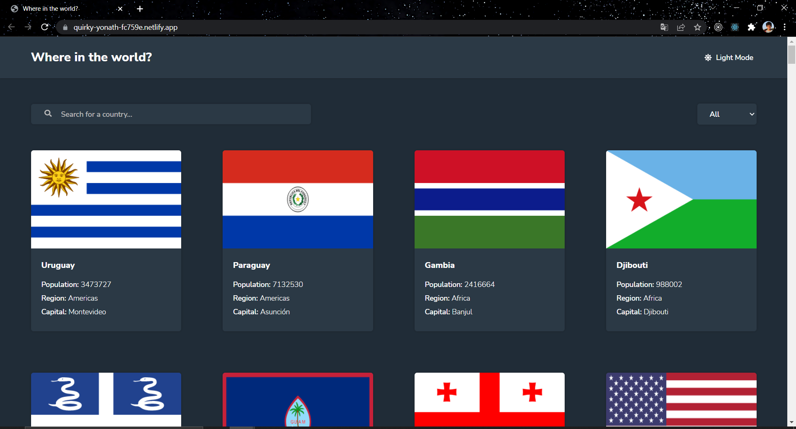
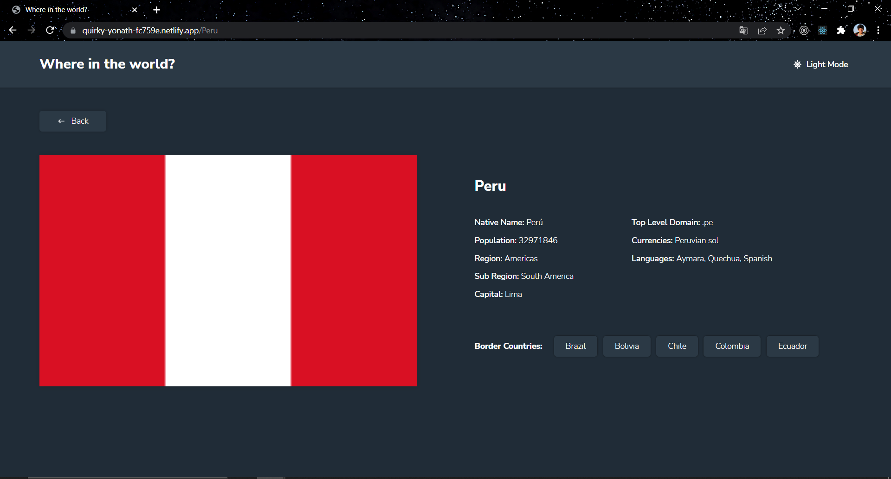

# Frontend Mentor - REST Countries API with color theme switcher solution

This is a solution to the [REST Countries API with color theme switcher challenge on Frontend Mentor](https://www.frontendmentor.io/challenges/rest-countries-api-with-color-theme-switcher-5cacc469fec04111f7b848ca). Frontend Mentor challenges help you improve your coding skills by building realistic projects.

## Table of contents

- [Overview](#overview)
  - [The challenge](#the-challenge)
  - [Screenshots](#screenshots)
  - [Links](#links)
- [My process](#my-process)
  - [Built with](#built-with)
  - [Useful resources](#useful-resources)
- [Author](#author)

**Note: Delete this note and update the table of contents based on what sections you keep.**

## Overview

### The challenge

Users should be able to:

- See all countries from the API on the homepage
- Search for a country using an `input` field
- Filter countries by region
- Click on a country to see more detailed information on a separate page
- Click through to the border countries on the detail page
- Toggle the color scheme between light and dark mode *(optional)*

### Screenshots

### Links

- Solution URL: [https://github.com/FelixGonzalo/WhereInTheWorld](https://github.com/FelixGonzalo/WhereInTheWorld)
- Live Site URL: [https://quirky-yonath-fc759e.netlify.app/](https://quirky-yonath-fc759e.netlify.app/)

## My process

### Built with

- Semantic HTML5 markup
- CSS custom properties
- Flexbox
- CSS Grid
- Mobile-first workflow
- [React](https://reactjs.org/) - JS library
- [SASS](https://sass-lang.com/) - For styles

### Useful resources

- [React Icons](https://react-icons.github.io/react-icons/) - Work with icons easily.
- [Pure CSS Loaders](https://loading.io/css/) - to get loaders

## Author

- Website - [Felix Castro](https://felixgonzalo.github.io/portafolio/)
- Frontend Mentor - [@FelixGonzalo](https://www.frontendmentor.io/profile/FelixGonzalo)
